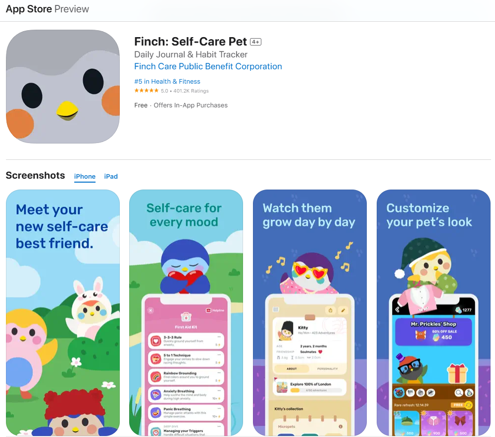
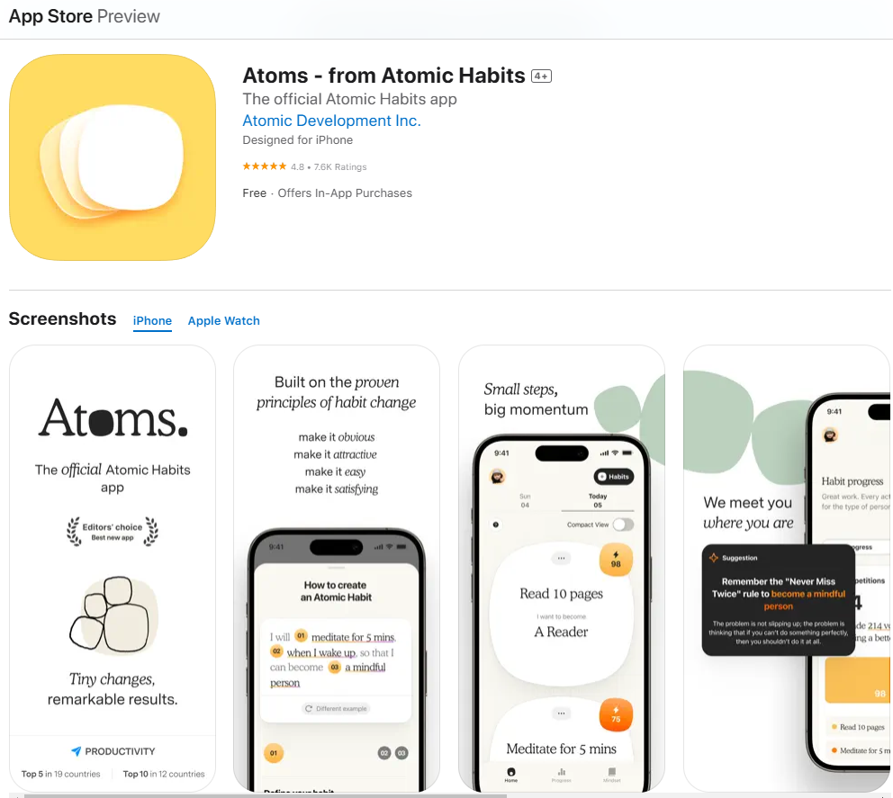

1. What makes Focus Bear different from these apps?

- The AI integrated to block the distractions through website and application at the same time.

2. If you were a user, why would you choose Focus Bear over competitors?

- I would choose FB but not as my primary productive app.

3. What’s one feature that other apps have that Focus Bear doesn’t?

- Other apps focus more to design the consistent and interesting UI to keep the user feel engaged. For example, this Finch productive app use the pet theme with tamagochi gaming style to keep users engaging with their app.
  
- Another competitor with modern and minimalist design style is Atoms. They use vibration as the tool with the minimal use of elements to create the UI for the app. This app also offer the reward system for users by providing the vibration with sound effect to keep users feel rewarded when they logged in their habit and finished them.
  

4. Based on your research, what’s one improvement you think Focus Bear could make?

- The biggest thing I could see as a multimedia designer is a consistent theme for the app especially mobile app. By having the design guidelines for the app, it is easier to follow the guidelines and know how to integrate and improve the app within the company guided style while keep the app consistent aesthetic at the same time.
