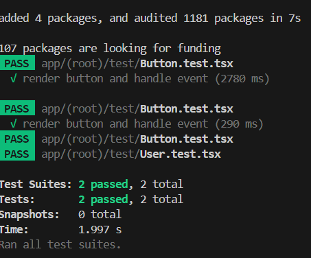

Writing Unit and Integration Tests for React Native #67

📌 Why is testing important in React Native component?
By creating test and ensuring that new components passing the tests, the app will be assured to work correctly and does not break after the specific changes or neglecting some simple bugs. Catching simple bugs early by passing unitand integration tests help making the app more reliable.

📌 How do you mock API calls in tests?
By using jest.fn() as a fake function helps us track the mock API calls instead of actually fetching API from internet because it need more time to get the results. Setting the name to John Doe with fetch ensures that it always return John Doe to test the function and receive the results faster and easier to run rather than waiting for real API response.

📌 Whats the difference between unit and integration tests?
From my research, unit tests check a small part of the code or a single component such as a specific function, a button or reusable heading. The example for unit test is the Button test file in the test folder. Integration tests check the collaboration between different parts like are those parts working together, does the way they work as you intended. For example, write the test to check when user click the login button, it has to fetch the user data and display the name on the screen. 