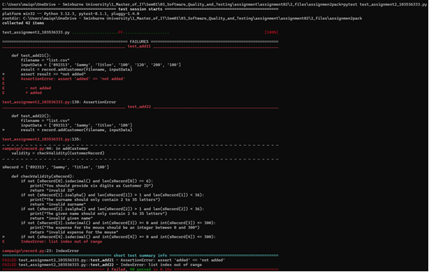
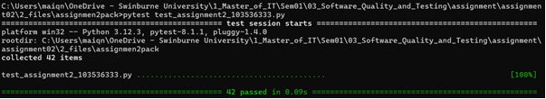

Writing Unit Tests for Clean Code #35

📌 How do unit tests help keep code clean?
Within this code base, I did not implement any math functions to face the issues creating by lacking handling errors and edge cases. However, based on my previous experiences, by creating and maintaining unit tests, the code base has the general filter to minimize the possible proportions of bugs that could be caused by simple problems.

📌 What issues did you find while testing?
There are some common issues I found while testing which are: lack of guard clauses within conditions, forgot to early validating inputs, not handling enough edge cases by sanitizing inputs, validating input types before processing and returning error when needed.

Commenting & Documentation #37
📌 When should you add comments?
I add comments to explain the code, not details what the code about, demonstrate complex logic, and clarify limitations about the function.

📌 When should you avoid comments and instead improve the code?
Avoiding add comments when the logic is obvious and simple, should not explaining the basic syntax and always updating comments when changing or improving the code.
