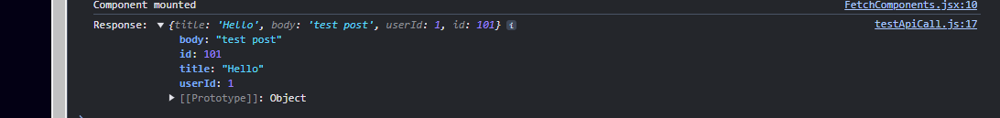

Making API Calls with Axios #12

📌 Why is it useful to create a reusable Axios instance?
From my experience, creating a Axios instance will allow me reuse it whenever I want without declare the new one every time I need it.

📌 How does intercepting requests help with authentication?
By integrating interception with authentication, I think that it mean that Axios will check every request before sending to increase the security.

📌 What happens if an API request times out, and how can you handle it?
By setting the timeout for the Axios request, it stops and gives and error when the API take too long to proceed. This method could help us push performance and cut the resources when it need more time than we expected.
