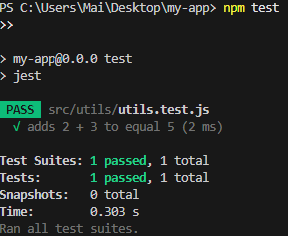
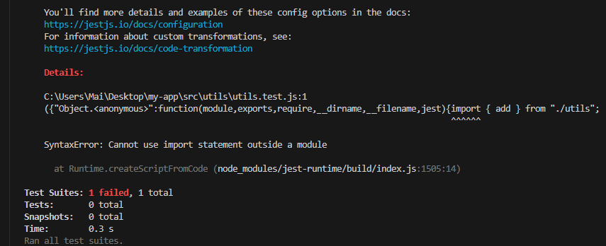
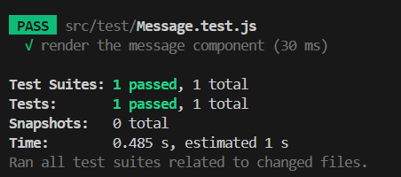
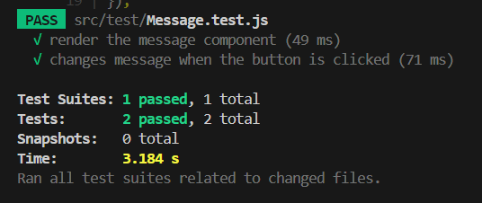

Introduction to Unit Testing with Jest #16

📌 Why is automated testing important in software development?
By using automated testing, software could be automatically checked before implementation. With simple changes, automated testing could quickly check the new updates and implement it right away, help the CI/CD process continuously and reduce waiting time. Automatically testing could also help us check the small problems and tackle them immediately before they become serious.

📌 What did you find challenging when writing your first Jest test?
I encounter the problem with exporting the function and importing within the test. The test file did not accept the import statement outside the module. After researching this error, I realize that Jest does not support ES module including import function by default. Because of that, I have to change to commonJS syntax to fix this problem by module exports and require syntax.

Testing React Components with Jest & React Testing Library #15

📌 What are the benefits of using React Testing Library instead of testing implementation details?
By using Jest & React Testing Library, it provides the accessibility for developers to specify which actions to be simulated which is useful to test the functionality of each component. Ignoring the minor UI problems while testing is another advantage, Jest and React Testing Library focus on problems related to the functions rather than stopping the test when the class name or state are wrong. Allowing developers to specify which part the test want to access such as specific labels, role names, or text content is the big benefit as well.

📌 What challenges did you encounter when simulating user interaction?
One of the disadvantages I encountered is knowing when to use fireEvent or userEvent. Despite understanding that fireEvent triggered the event instantly and userEvent allowed action delay to mimic user behaviour, sometimes it is hard to decide which should be used. Another problem of userEvent is calculating the amount of delay time is difficult while develope has to ensure that the time is resonable enough to mimic user interaction in real life. Mistyping the text is also another problem that I need to fix while writing test cases. Sometimes the test case just fails because I typed the wrong text compared to the text in the component. 

Mocking API Calls in Jest #14

📌 Why is it important to mock API calls in tests?
By mocking API calls, testers or developers could receive the results more quickly without the need of accessing internet therefore the test cases will be tested rapidly, reliable with immediate responses. This method is also allowed developers to test the function without the access of API calls and easier to test edge cases or different scenarios such as slow response, errors 404 or server errors.

📌 What are some common pitfalls when testing asynchronous code?
The first time writing the test for API I forgot to use waitFor() and the test failed because the element had not appeared yet to be tested. There are some tests failed because lacking of reject promise handlings. After few times I realised that I have to use mockRejectValue() to simulate value otherwise the test would be failed.

Testing Redux with Jest #13

📌 What was the most challenging part of testing Redux?
For me it is hard to create the test case for Redux by myself, the Redux test case for this task were the product after researching some other's recommendations on Stackoverflow and GPT to explain to me the step to create the Redux testing case. During to the recommendations on Stackoverflow, they mentioned about applying middleware in testing but when I config it in the test case, the tests failed. After few times trying, I took it out and the test cases passed so for me apply middleware is tricky while testing Redux with Jest.

📌 How do Redux tests differ from React component tests?
From my point of view, React component tests are more about testing UI and component behaviors after user interacting with them. In that case, user simulation test cases are created to ensure that the components behave as expected with or without user interactions and between related components. 
With Redux test cases, they mostly focus on checking the states and actions, are they updated correctly based on the actions, testing async actions to assure the store behaving as expected is important as well. With that aims in mind, Redux test cases that I created need to verify the actions,and state changes when the state updates.