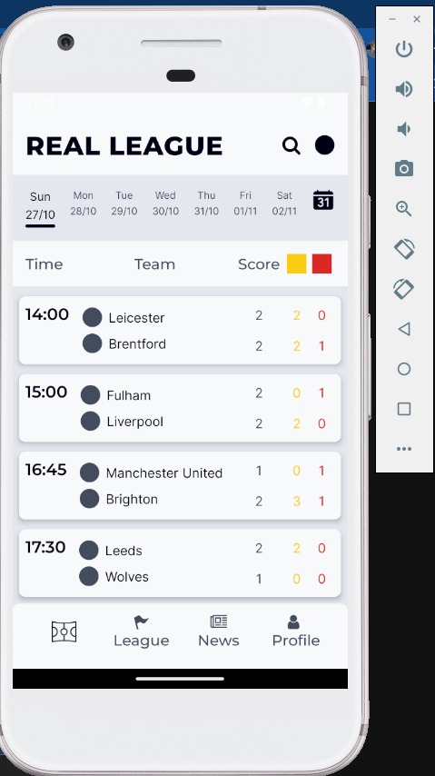
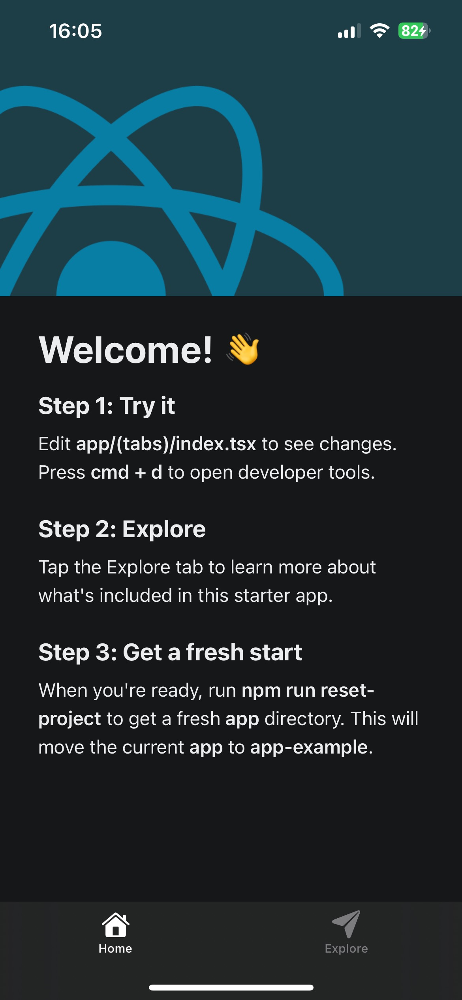

Setting up a React Native Development Environment (Expo & Metro server) #78

📌 What is the role of Metro in React Native development?
When installing React Native, Metro is already included as a package with it. Based on my research in React Native documents, the main roles of Metro are: 
    - Optimizing code to the format for performance optimization on mobile device.
    - Enabling update immediate without the need of restarting the app
    - Compling the changed part of code only therefore speed up the development process
    - Build the different bundles for each platform including android and ios by creating files such as ios.js and android.js

📌 How does Expo simplify React Native development?
From my own experience, when you have the devices ready with Expo installed, it is quicker to test the app on Expo app rather than build and run the environment and setup Android Studio to test. Expo also have access to camera, push notfications, etc. on your devices. I did use Expo through my iPhone app and Android simulator, both of them are really good and consistent. 

📌 What issues did you encounter, and how did you resolve them?
I did encounter some issues from my previous project including:
    - Cannot apply TailwindCSS style after install the package -> Solutions: end the project and run it again. React Native is different with web development so some changes could not be changed immediately
    - When I worked in a team to build a React Native app, I cannot see the changes Expo app of the project that I was editting because I did not know how the React Native file structure works. After checking and testing by myself, I did solve that problem.